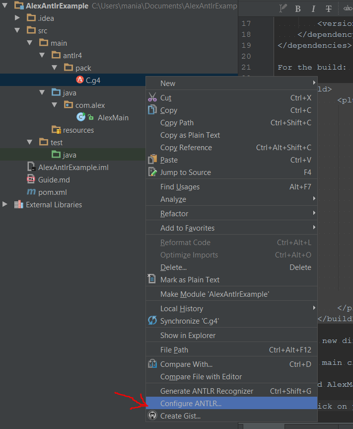
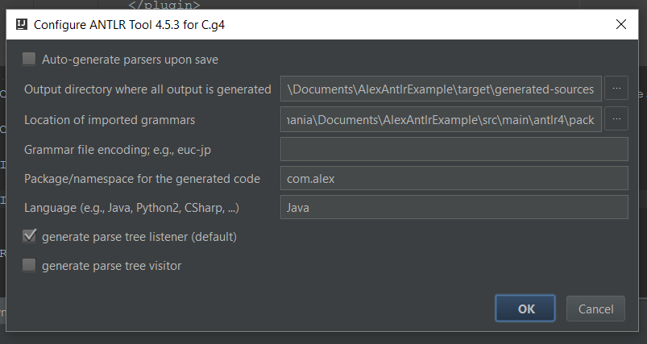
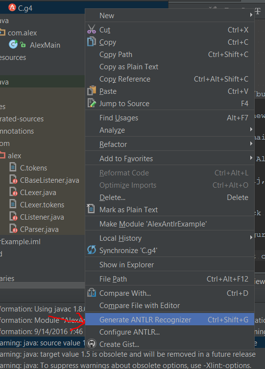
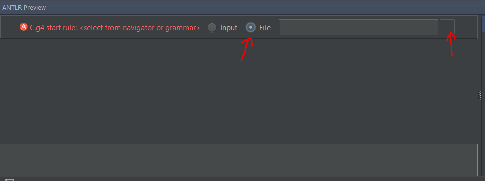
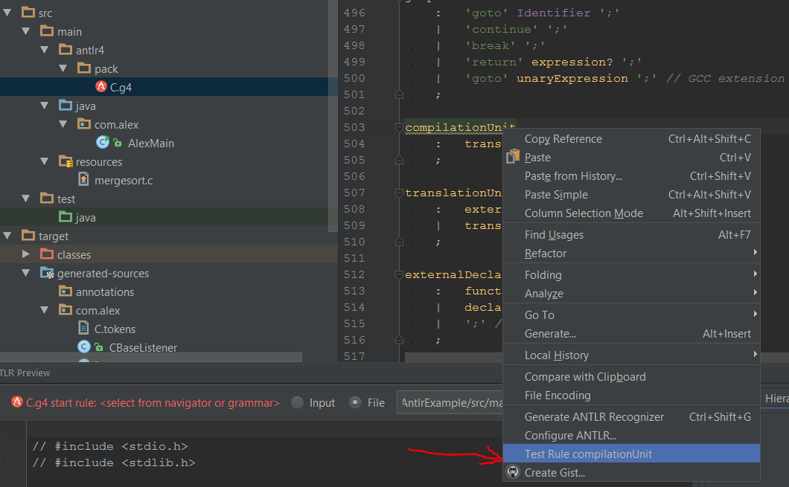
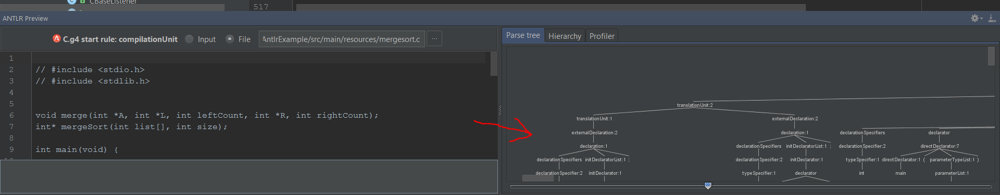

# Using Antlr with IntelliJ

First we need to install the intellij plugin located at https://plugins.jetbrains.com/plugin/7358?pr=

Scroll down to the downloads and download the newest one.

In intellij go to Settings > Plugins > Install plugin from disk, and select the zip file you downloaded.

## Now to edit our pom

Add the antlr runtime dependency: 

```
<dependencies>
    <dependency>
        <groupId>org.antlr</groupId>
        <artifactId>antlr4-runtime</artifactId>
        <version>4.5.1</version>
    </dependency>
</dependencies>
```

For the build: 

```
<build>
    <plugins>
        <plugin>
            <groupId>org.antlr</groupId>
            <artifactId>antlr4-maven-plugin</artifactId>
            <version>4.5.1</version>
            <executions>
                <execution>
                    <goals>
                        <goal>antlr4</goal>
                    </goals>
                </execution>
            </executions>
        </plugin>
    </plugins>
</build>
```

You can see the full pom.xml within this project.
        
## Get the project started

Create a new directory at `src/main/antlr4/pack` and place your grammar in there.

Create a main class in `src/main/[your.package]`

I created AlexMain.java under `src/main/com/alex`

In Intellij, do Build > Make Project.

## Configuring Antlr

Right click on your grammar file and click "Configure ANTLR..."



And configure it like so:



Then right click your grammar again and select "Generate ANTLR Recognizer"



This will produce a lot of java classes in the directory that you specified for output.
In this case, `target/generated-sources/com/alex`

We can now use these classes in our original main class to get started.

Take a look at the main class (AlexMain.java) to actually see the code.

The interesting line is `ParseTree tree = cparser.compilationUnit();`
 
The method `compialtionUnit` was created by antlr, and calling this on the parser
tells the parser to start at the rule `compilationUnit` within the grammar. 
If you need to start at a different rule, call that on the parser. For example,
 if we wanted to start with the "argumentExpressionList" rule from the C grammar, 
 we would call `ParseTree tree = cparser.argumentExpressionList();`
 
##  USING the plugin view

In Intellij, go to View > Tool Windows > ANTLR preview.

We will pick the file as input, choose the file `mergesort.c` that we were just working with.



Now go into the grammar file (`C.g4`) and right click on the starting rule, `compilationUnit`,
 and click "Test Rule compilationUnit."
 

 
You should now see a visualization of the tree in the antlr tool window.


